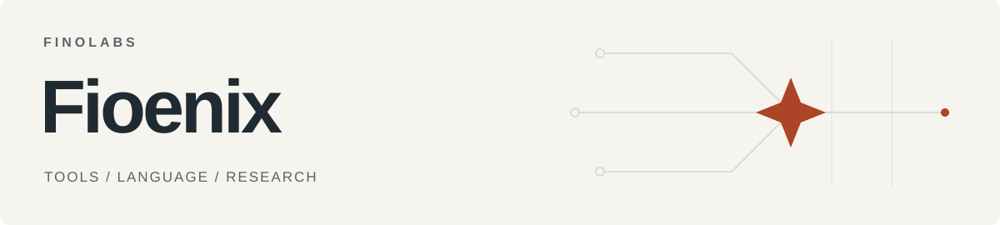

<picture>
  <source media="(prefers-color-scheme: dark)" srcset="assets/banner-dark.svg">
  <source media="(prefers-color-scheme: light)" srcset="assets/banner-light.svg">
  
</picture>

# Hi, I'm Fioenix

**Building with [FINOLABS](https://github.com/finolabs) · Ho Chi Minh City, Vietnam.**

I build tools for working with AI agents, writing natural Vietnamese, and testing ideas against evidence.

  <picture>
    <source media="(prefers-color-scheme: dark)" srcset="https://github-stats-extended.vercel.app/api?username=fioenix&amp;hide_rank=true&amp;hide=contribs%2Ccommits&amp;show_icons=false&amp;disable_animations=true&amp;border_radius=12.0&amp;custom_title=Public+GitHub+activity&amp;bg_color=16162A&amp;text_color=FFFFFF&amp;title_color=7FE2CE&amp;icon_color=C9A8E5&amp;border_color=FFFFFF1A">
    <source media="(prefers-color-scheme: light)" srcset="https://github-stats-extended.vercel.app/api?username=fioenix&amp;hide_rank=true&amp;hide=contribs%2Ccommits&amp;show_icons=false&amp;disable_animations=true&amp;border_radius=12.0&amp;custom_title=Public+GitHub+activity&amp;bg_color=FFFFFF&amp;text_color=0B0B17&amp;title_color=156B58&amp;icon_color=9750C4&amp;border_color=DCDCE8">
    
  </picture>

Public stats via [GitHub Stats Extended](https://github.com/stats-organization/github-stats-extended), refreshed periodically. [View activity](https://github.com/fioenix#contributions).

## What I've built

- **[Vietnamizer](https://github.com/fioenix/vietnamizer)** — An agent skill that makes Vietnamese writing read naturally while preserving meaning, facts, and the writer's voice. [Get started](https://github.com/fioenix/vietnamizer#cài-nhanh).

- **[Ignis](https://github.com/fioenix/fn-ignis)** — A self-hosted research harness for testing market hypotheses against social-source evidence. Makes observations, contrary evidence, and unanswered questions inspectable. **Under development** — [source and release status](https://github.com/fioenix/fn-ignis#verification-and-release-status).

- **[Huly Skill](https://github.com/fioenix/huly-skill)** — A CLI and MCP server for managing tasks, projects, documents, milestones, and comments in Huly through an agent workflow. [Get started](https://github.com/fioenix/huly-skill#install-per-agent).

---

[Explore my public repositories](https://github.com/fioenix?tab=repositories&type=public) · [FINOLABS](https://github.com/finolabs)
