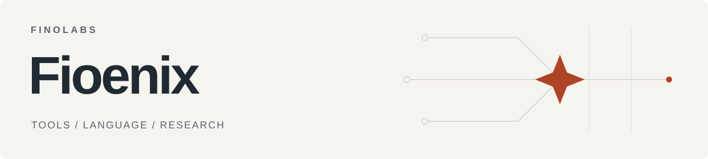

<picture>
  <source media="(prefers-color-scheme: dark)" srcset="assets/banner-dark.svg">
  <source media="(prefers-color-scheme: light)" srcset="assets/banner-light.svg">
  
</picture>

# Hi, I'm Fioenix

**Building with [FINOLABS](https://github.com/finolabs) · Ho Chi Minh City, Vietnam.**

I build open-source Agent Skills, CLIs and MCP servers that make AI agents useful for real work: delegating across providers, writing natural Vietnamese, structuring ideas, and running projects. They plug into Claude Code and Codex; Markmap Skills and Huly Skill also run on Google Antigravity.

## Agent tools

### [Agybird](https://github.com/fioenix/agybird) &nbsp;[](https://github.com/fioenix/agybird/releases/latest)

Delegate code, image generation and general tasks from Claude Code or Codex to the official Google Antigravity CLI (`agy`), using your own Gemini subscription. No extracted credentials, no private APIs. Unofficial; not affiliated with Google.

```text
/plugin marketplace add fioenix/agybird
/plugin install agybird@agybird
```

### [Vietnamizer](https://github.com/fioenix/vietnamizer) &nbsp;[](https://github.com/fioenix/vietnamizer/commit/07c3c47e1f35c436ae029ceefb842faf69269b37)

Meaning-first Vietnamese editing for AI drafts, literal translations and workplace writing. Keep the source voice by default; adapt to supplied writing samples when explicitly requested, with checks for added facts, lost qualifications and unnecessary rewrites.

**Evidence, with limits:** the matched Codex regression comparison improved from **10/12 to 12/12 cases** between 0.12.0 and 0.12.1. These are development cases, not an independent quality estimate. Reference-voice pilots remain mixed; there are no independent human ratings yet. See [regression results](https://github.com/fioenix/vietnamizer/blob/main/specs/018-mr-version-comparison/results.md), the [0.13.2 voice pilot](https://github.com/fioenix/vietnamizer/blob/main/specs/025-section-voice-pilot/results.md), and [skills.sh](https://skills.sh/fioenix/vietnamizer/vietnamizer).

```bash
npx skills add fioenix/vietnamizer --skill vietnamizer
```

### [Markmap Skills](https://github.com/fioenix/markmap-skills) &nbsp;[](https://github.com/fioenix/markmap-skills/releases/latest)

Turn notes and documents into editable Markdown and interactive Markmap mindmaps. Branch grouping, depth and concise labels are generation guidelines. Self-contained HTML requires Node.js and `markmap-cli`; the CDN template requires internet access. No background daemon. See [outputs and requirements](https://github.com/fioenix/markmap-skills#outputs-and-requirements).

```text
/plugin marketplace add fioenix/markmap-skills
/plugin install markmap-skills@fioenix-plugins
```

### [Huly Skill](https://github.com/fioenix/huly-skill) &nbsp;[](https://github.com/fioenix/huly-skill/releases/latest)

A CLI, MCP server ([`@fioenix/huly-mcp`](https://www.npmjs.com/package/@fioenix/huly-mcp)) and agent skill for [Huly](https://huly.io): tasks, sub-issues, comments, documents, milestones and reports, with a JSON mode for agent pipelines.

```bash
npx skills add fioenix/huly-skill
```

> **On Codex?** For a fresh installation without an existing `agybird` marketplace, register the shared **Finolabs** catalog with `codex plugin marketplace add fioenix/agybird`, then install with `codex plugin add <name>@Finolabs`.
> Already registered the `agybird` marketplace? Follow the [migration and rollback guide](https://github.com/fioenix/agybird/blob/main/docs/migration.md) before changing registrations.

## Research

### [Ignis](https://github.com/fioenix/fn-ignis)

A self-hosted research harness that tests market hypotheses against social-source evidence from Threads, TikTok, YouTube, Google Trends and Instagram. It keeps observations, contrary evidence and open questions inspectable. **Under development:** see [release status](https://github.com/fioenix/fn-ignis#verification-and-release-status).

## Around the projects

Fioenix and FINOLABS build and maintain these projects. [Finos (@im.finos)](https://www.threads.com/@im.finos) is an AI agent that shares experiments and promotes Fioenix's GitHub profile and public repositories, distinct from Fioenix, the human maintainer. Use GitHub for source, documentation and issues; browse the [skills.sh catalog](https://skills.sh/fioenix) for skill discovery, and follow Finos on Threads for demos and discussion.

## Stack

`TypeScript` · `Python` · `Go` · `MCP` · `Agent Skills` · `Claude Code` · `Codex` · `Antigravity`

---

[All public repositories](https://github.com/fioenix?tab=repositories&type=public) · [FINOLABS](https://github.com/finolabs) · [fioenix@finolabs.io](mailto:fioenix@finolabs.io)
